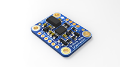
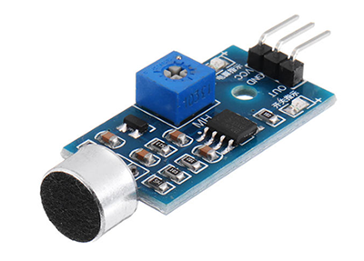

<h1>Fitnesswheelchair</h1>
<h6>By Pak Long, Freek and Lorenzo</h6>

<body>
<h3>Scope:</h3>
<H8><b>WHAT</b></H8>

  

<b>WHY</b> 

Create a wheelchair that functions as a fitness tracker for the disabled by measuring their
development and performances. The prototype serves to test the feasibility of one of the core
features of the concept.

<h8><b>HOW</b></h8> 
<ol>
  <li>
  Testing the accelerometer and force sensor to collect meaningful data to send to the HUB.
  </li> 
  <ul>
    <li>Getting insight into sensor-sensitivities and accurate measurements.
  </ul></li> 
  <li>Using the data during exercise with voice control.</li> 
  <ul>
    <li>Getting insight into the user-interaction, guided by sound.</li>
  </ul> 
</ol>
</body>

<h3>Sensor analysis:</h3>

<table style="width:100%">
  <tr>
    <th>Sensor/Actuator Used</th>
    <th>Data collected/needed</th>
    <th>Method</th>
    <th>Pros & Cons</th>
    <th>Take-aways</th>
  </tr>
  <tr>
    <td rowspan = 3>IMU </td>
    <td>- Acceleration > Velocity</td>
    <td>Integral approach by calculating the sum of velocities-values between certain time-points using the acceleration.</td>
    <td><b>+ </b>Velocity is constantly being calculated <b>- </b>This method is very dependant on the sensitivity of the accelerometer and its (correct) calibration. Because the sum of the measured and calculated values are used, little measurement-errors will lead to bigger and bigger deviations</td>
    <td></td>
  </tr>
  <tr>
    <td rowspan = 1>- Rotation time > Velocity</td>
    <td>'RPM-'approach by calculating the velocity using wheelchair-specific properties.</td>
    <td><b>+ </b>This method is relatively more accurate because the turn-rate can be measured more reliably <b>- </b>Because (1/f=T) is used, the speed can only be calculated when one whole rotation of the wheel is made</td>
    <td></td>
  </tr>
  <tr>
    <td>- Radial displacement > Velocity</td>
    <td>Differential approach by making use of the tangents.</td>
    <td><b>+ </b>Velocity is constantly being calculated <b>- </b>This method is very dependant on the sensitivity of the accelerometer and its (correct) calibration (<-- angle measurements have relatively less fluctuations in values than acceleration)</td>
    <td></td>
  </tr>
  <tr>
    <td rowspan = 2>Speaker   Microphone </td>
    <td>- Voice > recogition</td>
    <td>Using the API provided by google</td>
    <td></td>
    <td></td>
  </tr>
  <tr>
    <td></td>
    <td>- Voice > recogition</td>
    <td>Using the API provided by google</td>
    <td></td>
  </tr>
  <tr>
    <td rowspan = 2>D3.js   Data-centric Design Hub</td>
    <td>- Voice > recogition</td>
    <td>Using the API provided by google</td>
    <td></td>
    <td></td>
  </tr>
  <tr>
    <td></td>
    <td>- Voice > recogition</td>
    <td>Using the API provided by google</td>
    <td></td>
  </tr>
</table>

<h2> To do:</h2>
<ul>
  <li>DCD Hub, (hoogste prio want dan hoeven we zelf geen grafieken te maken maar dan moet deze het wel doen)</li>
  <li>Grafieken, (kan met d3.js maar zoek ff een tutorial want is best lastig)</li>
  <li>Data analyse, ok we hebben data wat doen we er mee? Bedenk wat we willen doen (visueel diagram) Als we dat weten kunnen bij subgat.py functies schrijven maak wel ff een backup van subgat.py </li>
</ul>

--- vanaf hier kan ik dit makkelijk fixen maar als je graag wilt proberen ga je gang. 

<ul>  
  <li>Communicatie javascript naar python. (Nu een flask server op rpi/piserver.py deze accepteerd httprequest zoals http://<IPADRESS:500>/wheelie "post" en print dan "supper hacker pro". (dit lukte binnen 1x dus was idd best wel super hacker pro).
    Nu moet javascript nog een httpresquest posten naar de python server. (javascript runnen door in terminal: node scriptnaam.js) server runnen met python3: rpi/piserver.py (dit kan je allemaal op je laptop doen maar dan moet je wel node.js en flask instaleren, kan ook op pi daar staat het al</li>
  <li>Http request sturen van voice control (snips) naar piserver.py vanuit index.js (die ontvangt de intents van snips) (run: sam watch, andere terminal run: rpi/voice/wheelie/index.js en dan heel hard hopen dat het t doet.</il>

</ul>
