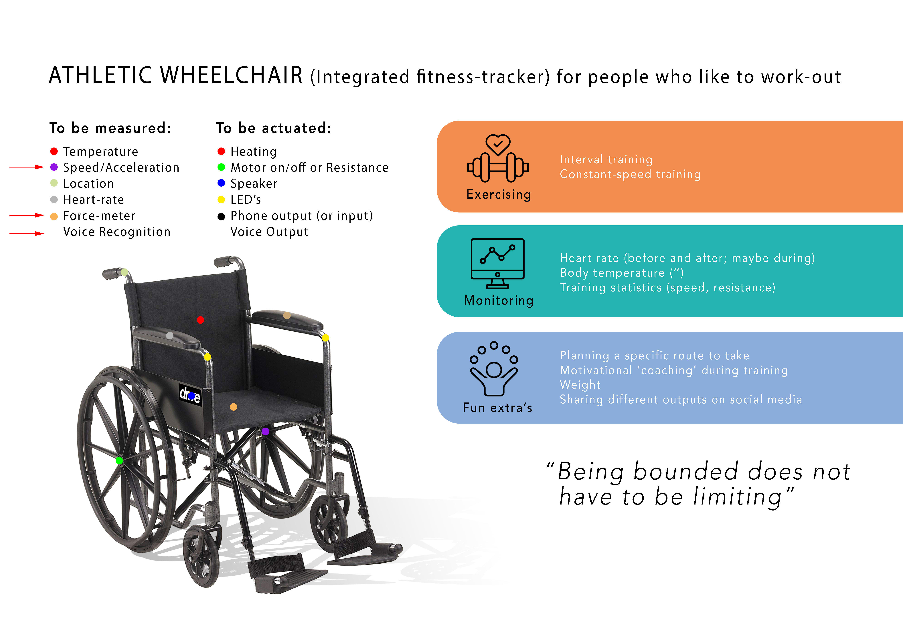

# Fitnesswheelchair
By Pak Long, Freek and Lorenzo

Scope:

- WHY

Create a wheelchair that fuctions as a fitness tracker for the disabled, measuring their development, current performance and enable evaluation 

- HOW
 

- WHAT

  1. Testing the accelerometer and force sensor to collect meaningfull data to send to the HUB
      1.1 Getting insight into sensor-placement
  
  2. Using the date during exercise, with voice controll
      2.2 Getting insight in the user-interaction, guided by sound
