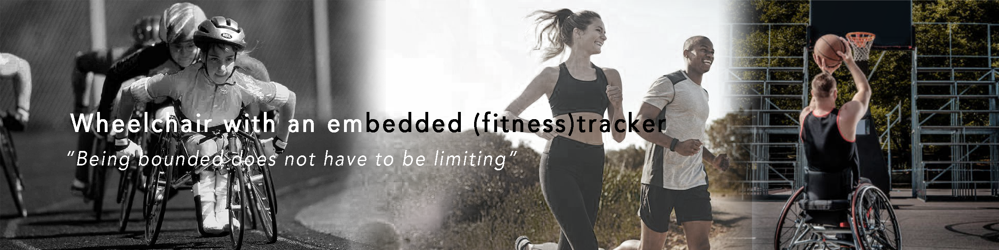
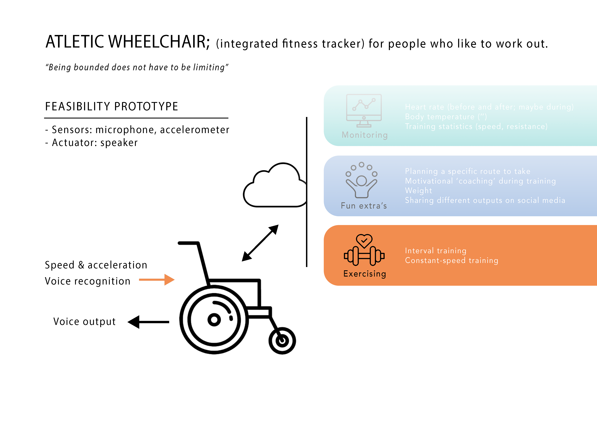

<!DOCTYPE html>
<html>
<head>
<title>Fitnesswheelchair</title>
</head>
<h1>Fitnesswheelchair</h1>
<h6>By Pak Long, Freek and Lorenzo</h6>
  
An extensive documentation about the <b>process, product and prototype</b> can be found at the website of the
<a href="https://paklongc.github.io/Fitnesswheelchair"><b>Wheelchair++</b></a>  
<li><i><u>Project description</u></i> describes the mission and vision of the <b>concept</b> and the technologies and sensors used in the <b>prototype</b>.</li> 
<li><i><u>GitHub</u></i> is a link to the GitHub of our entire project.</li> 
<li><i><u>Home</u></i> contains the decision-making moments (in blog-posts form) regarding sensors and technologies used in the final prototype. The last blog-post aims to answer the research questions stated in the 'prototype page' </li>

<body>

<h3>Scope:</h3>
<H8><b>WHAT</b></H8>

<H8><b>WHY</b></H8>
<ul>
	  <li>Create a wheelchair that functions as a fitness tracker for the disabled by measuring their development and performances. The prototype serves to test the feasibility of one of the core features of the concept.</li>
</ul>
<H8><b>HOW</b></H8> 
<ul>
	  <li> Testing the accelerometer and force sensor to collect meaningful data to send to the HUB.</li>
      <ul>
        <li>Getting insight into sensor-sensitivities and accurate measurements.</li> 
      </ul>
	  <li>Using the data during exercise with voice control.</li>
    <ul>
      <li>Getting insight into the user-interaction, guided by sound.</li>
    </ul> 

<H8><b>Prototype architecture</b></H8> 

